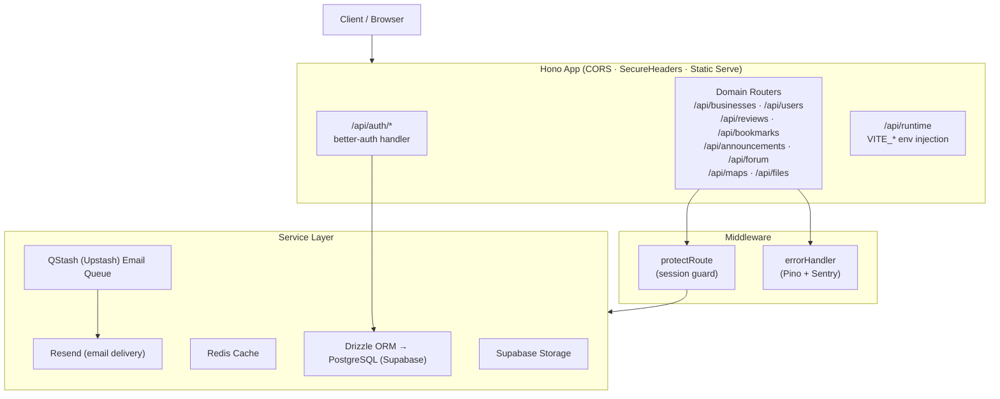
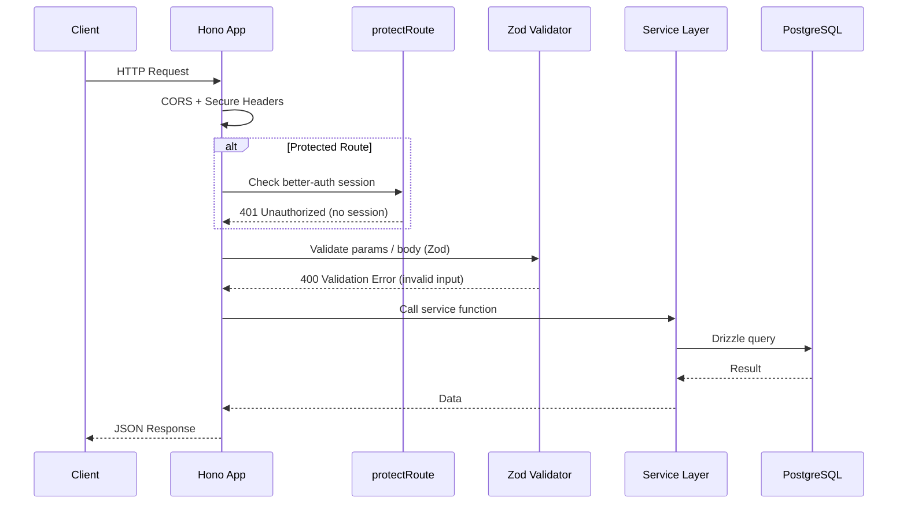
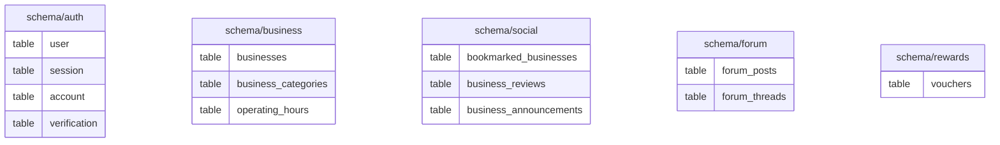
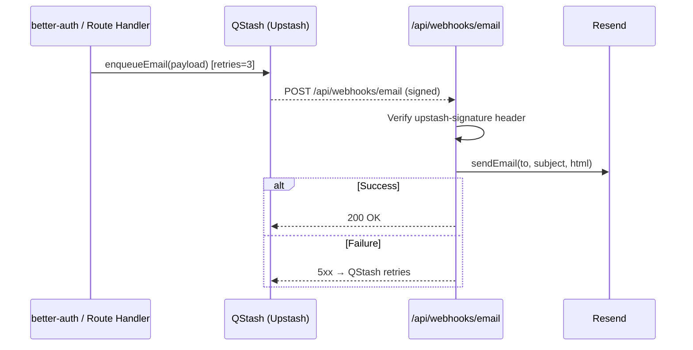

# 🚀 @localoco/server

The backend API for **LocaLoco** — a platform connecting the public with local businesses. Built with [Hono](https://hono.dev) running on the [Bun](https://bun.sh) runtime.

---

## 🛠️ Tech Stack

| Layer          | Technology                                                                  |
| -------------- | --------------------------------------------------------------------------- |
| Runtime        | [Bun](https://bun.sh) ≥ 1.1.56                                              |
| Framework      | [Hono](https://hono.dev) v4                                                 |
| Language       | TypeScript (ESNext)                                                         |
| Database       | PostgreSQL (Supabase) via [Drizzle ORM](https://orm.drizzle.team) v0.45.1   |
| Authentication | [better-auth](https://better-auth.com) v1.5 — Email/Password + Google OAuth |
| Cache          | [Upstash Redis](https://upstash.com/docs/redis) via `@upstash/redis`        |
| Message Queue  | [QStash (Upstash)](https://upstash.com/docs/qstash) via `@upstash/qstash`   |
| Email          | [Resend](https://resend.com) for transactional emails                       |
| File Storage   | [Supabase Storage](https://supabase.com/storage)                            |
| Logging        | [Pino](https://getpino.io) + [@logtail/pino](https://logtail.com) sink      |
| Error Tracking | [Sentry](https://sentry.io) (`@sentry/node`)                                |
| Validation     | [Zod](https://zod.dev) v4 + `drizzle-zod`                                   |
| Env Validation | [@t3-oss/env-core](https://env.t3.gg)                                       |
| API Docs       | [hono-openapi](https://github.com/honojs/hono-openapi) + Scalar             |

---

## 📁 Project Structure

```
apps/server/
├── index.ts                  # Bun server entrypoint (port binding, startup logs)
├── app.ts                    # Hono app: route mounting, static serving, auth handler
├── env.ts                    # Validated environment schema (@t3-oss/env-core + Zod)
├── drizzle.config.ts         # Drizzle Kit config
│
├── database/
│   ├── db.ts                 # Drizzle client (pg connection pool)
│   ├── schema.ts             # Re-exports all schema modules
│   └── schema/
│       ├── auth.ts           # better-auth tables: user, session, account, verification
│       ├── business.ts       # Business, categories, operating hours, etc.
│       ├── social.ts         # Bookmarks, reviews, announcements
│       ├── forum.ts          # Forum posts & threads
│       ├── rewards.ts        # Vouchers & rewards
│       ├── enums.ts          # Shared Postgres enums
│       └── relations.ts      # Drizzle table relations
│
├── lib/
│   ├── auth.ts               # better-auth configuration
│   ├── email-queue.ts        # RabbitMQ producer & consumer for transactional emails
│   ├── mailer.ts             # Resend email templates & send logic
│   ├── pino.ts               # Structured Pino logger instance
│   ├── redis.ts              # Redis client (caching)
│   └── supabase.ts           # Supabase admin client (storage)
│
├── middleware/
│   ├── protect-route.ts      # Auth guard — validates better-auth session
│   └── error-handler.ts      # Global error handler (HTTP, Zod, generic)
│
├── routes/
│   ├── announcement/         # Business announcement CRUD
│   ├── bookmark/             # User bookmark management
│   ├── business/             # Business listing, management, verification
│   ├── file/                 # Media asset uploads to Supabase Storage
│   ├── forum/                # Forum posts (public & management)
│   ├── maps/                 # Google Maps & OneMap geolocation
│   ├── review/               # Business reviews (CRUD + likes)
│   └── user/                 # User profile & vouchers
│
├── utils/                    # Shared utility helpers
├── validation-schemas/       # Standalone Zod schemas
└── tests/
    ├── unit/                 # Vitest unit tests
    └── integration/          # Integration tests
```

---

## 🔑 Environment Variables

All variables are validated at startup via `env.ts` using `@t3-oss/env-core`. The app will **throw and refuse to start** if any required variable is missing.

### Server-Only

| Variable                     | Description                                            |
| ---------------------------- | ------------------------------------------------------ |
| `NODE_ENV`                   | `development` or `production` (default: `development`) |
| `PORT`                       | Port the Bun server listens on                         |
| `DATABASE_URL`               | PostgreSQL connection string (Supabase)                |
| `BETTER_AUTH_SECRET`         | Secret key for better-auth session signing             |
| `GOOGLE_CLIENT_ID`           | Google OAuth client ID                                 |
| `GOOGLE_CLIENT_SECRET`       | Google OAuth client secret                             |
| `QSTASH_TOKEN`               | Upstash QStash API token (email queue producer)        |
| `QSTASH_CURRENT_SIGNING_KEY` | QStash signing key for webhook verification            |
| `QSTASH_NEXT_SIGNING_KEY`    | QStash next signing key for webhook key rotation       |
| `UPSTASH_REDIS_REST_URL`     | Upstash Redis REST API URL                             |
| `UPSTASH_REDIS_REST_TOKEN`   | Upstash Redis REST API token                           |
| `RESEND_API_KEY`             | Resend API key for transactional emails                |
| `SENTRY_DSN`                 | Sentry DSN for server-side error tracking              |
| `SUPABASE_URL`               | Supabase project URL                                   |
| `SUPABASE_SECRET_KEY`        | Supabase service role key (admin access for storage)   |
| `APP_URL`                    | Canonical application URL (used by better-auth)        |

### Client-Injected (prefixed `VITE_`)

Injected into the frontend at runtime via the `/api/runtime` endpoint.

| Variable                   | Description               |
| -------------------------- | ------------------------- |
| `VITE_APP_URL`             | Public-facing app URL     |
| `VITE_ONEMAP_EMAIL`        | OneMap API credentials    |
| `VITE_ONEMAP_PASSWORD`     | OneMap API credentials    |
| `VITE_GOOGLE_MAPS_API_KEY` | Google Maps JS API key    |
| `VITE_SENTRY_DSN`          | Sentry DSN for the client |
| `VITE_TEST_EMAIL`          | E2E test user credentials |
| `VITE_TEST_PASSWORD`       | E2E test user credentials |

Copy `.env.example` to `.env` and fill in the values before starting the server.

---

## ⚡ Getting Started

### Prerequisites

- [Bun](https://bun.sh) ≥ 1.3
- PostgreSQL database (Supabase project recommended)
- [Upstash Redis](https://console.upstash.com) instance (serverless)
- [Upstash QStash](https://console.upstash.com) account (serverless email queue)

### Install & Run

```bash
# Install dependencies from the monorepo root
pnpm install

# Start the dev server with hot-reload
bun run dev

# Or from the monorepo root
pnpm --filter @localoco/server dev
```

---

## 🏗️ Architecture Overview



### Request Lifecycle



---

## 🌐 API Routes

Each domain router exposes interactive API documentation via **Scalar**. View the full endpoint reference for each router at:

| Router        | Scalar UI                   |
| ------------- | --------------------------- |
| Businesses    | `/api/businesses/scalar`    |
| Users         | `/api/users/scalar`         |
| Reviews       | `/api/reviews/scalar`       |
| Announcements | `/api/announcements/scalar` |
| Bookmarks     | `/api/bookmarks/scalar`     |
| Forum         | `/api/forum/scalar`         |
| Maps          | `/api/maps/scalar`          |
| Files         | `/api/files/scalar`         |

### Webhooks (`/api/webhooks/*`)

| Method | Path                  | Description                                                              |
| ------ | --------------------- | ------------------------------------------------------------------------ |
| POST   | `/api/webhooks/email` | QStash delivery endpoint — processes email payloads (signature-verified) |

The raw OpenAPI JSON spec for each router is available at the corresponding `/<prefix>/openapi` path.

### Authentication (`/api/auth/*`)

Handled entirely by `better-auth`. Supports:

- **Email/Password** — sign up, sign in, email verification on sign-up, and password reset
- **Google OAuth** — `select_account consent` prompt
- Transactional emails are dispatched via QStash → `/api/webhooks/email` → Resend

### Special Endpoints

| Method | Path           | Description                                             |
| ------ | -------------- | ------------------------------------------------------- |
| GET    | `/health`      | Health check — returns `{ health: "ok" }`               |
| GET    | `/api/runtime` | Injects `VITE_*` env vars as a JS script for the client |

---

## 🔧 Middleware

### `protectRoute`

Validates the incoming request against the active `better-auth` session. Throws `401 Unauthorized` if no valid session exists. Applied per-route via Hono's middleware chaining.

### `errorHandler`

Global `app.onError` handler. Covers three cases:

| Error Type      | Response                                 |
| --------------- | ---------------------------------------- |
| `HTTPException` | Forwarded as-is with the original status |
| `ZodError`      | `400 ValidationError` with field details |
| All others      | `500 InternalServerError`                |

All errors are logged via Pino (structured with path/method/status) and captured by Sentry.

---

## 🗄️ Database

Drizzle ORM is used for all database interactions. The schema is split by domain:



### Supabase Row-Level Security (RLS)

RLS policies are defined inline in the Drizzle schema using `pgPolicy`. Key patterns:

- **Public read**: `for: "select", using: sql"true"`
- **Owner access**: `using: sql"owner_id = (select auth.uid())::text"`
- **Authenticated insert**: `to: "authenticated", withCheck: ...`

Route handlers should always assume RLS is active — never bypass it.

---

## ⚙️ Infrastructure Services

### Upstash Redis (Caching)

`lib/redis.ts` exports an Upstash Redis client used in the service layer to cache read-heavy data (businesses, reviews, etc.) with per-use-case TTLs. Upstash provides a serverless REST API — no connection pool or reconnect logic needed.

### QStash (Email Queue)

`lib/email-queue.ts` publishes email jobs to Upstash QStash, which delivers them to the `/api/webhooks/email` endpoint via HTTP. The webhook verifies the QStash signature before processing.



- Up to **3 delivery retries** built into QStash
- Signature verification at `routes/webhooks/qstash.ts` using `@upstash/qstash` `Receiver`

### Supabase Storage

`lib/supabase.ts` exports the Supabase admin client. The `/api/files/upload` route writes multipart uploads directly to the target Storage bucket and returns `{ url, path, bucket }`.

---

## 📜 Scripts

| Script             | Command               | Description                         |
| ------------------ | --------------------- | ----------------------------------- |
| Start dev server   | `bun run dev`         | Hot-reload dev server               |
| Generate migration | `bun run db:generate` | Generate Drizzle migration files    |
| Push schema        | `bun run db:push`     | Push schema changes to the database |
| Drizzle Studio     | `bun run db:view`     | Open Drizzle Studio                 |
