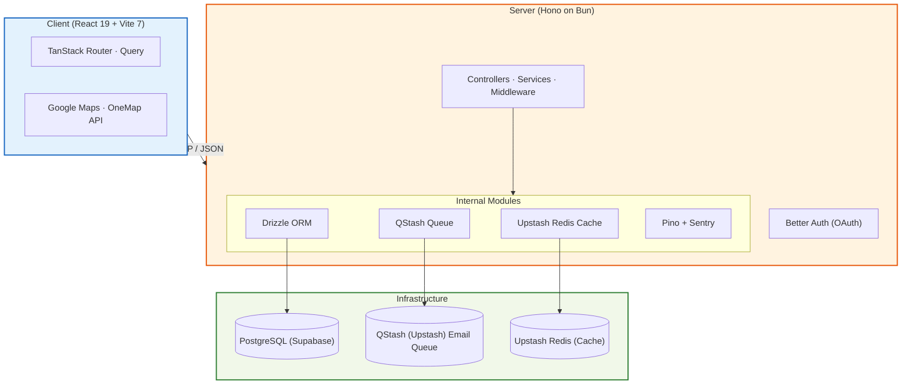

# Architecture

## System Overview



| Layer        | Component              | Purpose                                                                            |
| ------------ | ---------------------- | ---------------------------------------------------------------------------------- |
| **Frontend** | React 19 + Vite 7      | SPA with file-based routing (TanStack Router), async state (TanStack Query).       |
| **Backend**  | Hono on Bun            | Lightweight HTTP server with TypeScript-first middleware and service layers.       |
| **Database** | PostgreSQL via Drizzle | Type-safe ORM with schema push, migrations, and Zod-powered validation.            |
| **Cache**    | Upstash Redis          | Serverless caching layer for frequently accessed data.                             |
| **Queue**    | QStash (Upstash)       | Serverless message queue for async email dispatch via webhook.                     |
| **Auth**     | Better Auth            | Multi-provider authentication (Email/Password, Google OAuth) with Drizzle adapter. |

## Project Structure

```
localoco/
├── apps/
│   ├── server/                    # @localoco/server — Hono API on Bun
│   │   ├── app.ts                 # Hono app: middleware, route mounting
│   │   ├── index.ts               # Server entry point
│   │   ├── env.ts                 # Env validation (T3 Env + Zod)
│   │   ├── database/              # Drizzle schema, db client
│   │   ├── lib/                   # Auth, email-queue (QStash), mailer, Redis, Supabase
│   │   ├── middleware/            # protectRoute, errorHandler
│   │   ├── routes/                # Domain routers (business, user, forum, etc.)
│   │   └── tests/                 # Unit + integration tests (Testcontainers)
│   └── frontend/                  # @localoco/frontend — React 19 + Vite 7
│       ├── src/
│       │   ├── routes/            # TanStack Router file-based pages
│       │   ├── components/        # shadcn/ui + custom components
│       │   ├── hooks/             # Custom React hooks
│       │   └── lib/               # Auth client, utilities
│       └── index.html
├── shared/
│   └── types/                     # Cross-cutting TypeScript types
├── turbo.json                     # Turborepo pipeline config
└── pnpm-workspace.yaml            # pnpm monorepo workspace
```

## Tech Stack

| Category         | Technology                                                                                                         |
| ---------------- | ------------------------------------------------------------------------------------------------------------------ |
| Language         | TypeScript (ESNext, strict mode)                                                                                   |
| Runtime          | [Bun](https://bun.sh/) ≥ 1.3                                                                                       |
| Package Manager  | [pnpm](https://pnpm.io/) ≥ 10.30                                                                                   |
| Frontend         | [React](https://react.dev/) 19 + [Vite](https://vite.dev/) 7                                                       |
| Styling          | [Tailwind CSS](https://tailwindcss.com/) v4 + [shadcn/ui](https://ui.shadcn.com/)                                  |
| Routing          | [TanStack Router](https://tanstack.com/router)                                                                     |
| State Management | [TanStack Query](https://tanstack.com/query)                                                                       |
| Maps             | [Google Maps API](https://developers.google.com/maps) · [OneMap API](https://www.onemap.gov.sg/) (SG postal codes) |
| Server Framework | [Hono](https://hono.dev/)                                                                                          |
| ORM              | [Drizzle ORM](https://orm.drizzle.team/) + PostgreSQL                                                              |
| Authentication   | [Better Auth](https://www.better-auth.com/)                                                                        |
| Caching          | [Upstash Redis](https://upstash.com/docs/redis)                                                                    |
| Message Queue    | [QStash (Upstash)](https://upstash.com/docs/qstash)                                                                |
| Email            | [Resend](https://resend.com/)                                                                                      |
| Validation       | [Zod](https://zod.dev/) + [T3 Env](https://env.t3.gg/)                                                             |
| Error Tracking   | [Sentry](https://sentry.io/) → [Better Stack Errors](https://betterstack.com/errors)                               |
| Logging          | [Pino](https://getpino.io/) → [Better Stack Logs](https://betterstack.com/logs)                                    |
| Testing          | [Vitest](https://vitest.dev/) + [Playwright](https://playwright.dev/)                                              |
| CI/CD            | GitHub Actions + Vercel                                                                                            |

## Observability

```
Runtime Error
    ├── Sentry SDK ──────────► Sentry SaaS (error tracking + stack traces)
    └── Pino logger ─────────► Sentry SaaS (structured JSON logs)
```

- **Error tracking**: Sentry for Bun captures unhandled exceptions, forwarded to Sentry SaaS.
- **Structured logging**: Pino streams JSON logs in production, `pino-pretty` for local development.
